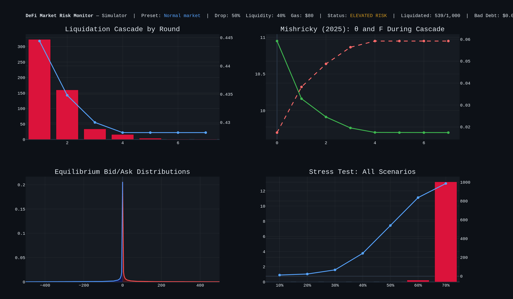
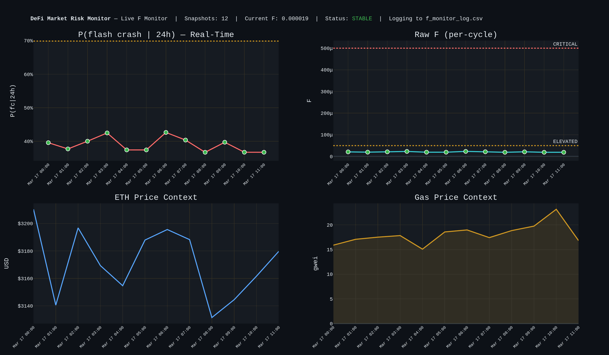
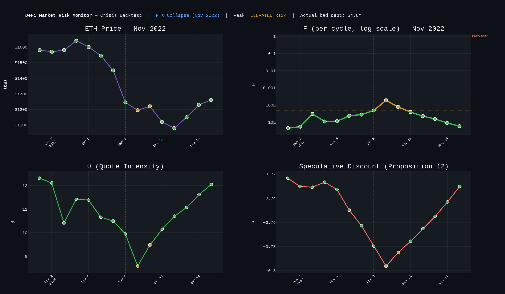

# DeFi Market Risk Monitor

A theory-driven market risk monitor for DeFi lending protocols. It combines agent-based liquidation cascade modelling with the equilibrium flash crash framework of Mishricky (2025) to expose a class of risk that standard protocol monitors miss: **a protocol can appear solvent — low bad debt, no cascading failures — while the liquidation market that keeps it solvent is already breaking down.**

## Overview

DeFi lending protocols like Aave let users borrow against crypto collateral. If the collateral price drops far enough, the protocol liquidates the position — a bot repays the debt and seizes the collateral at a discount. The danger is that liquidations can feed on themselves: the selling pressure from seized collateral pushes prices lower, triggering more liquidations, in a self-reinforcing loop that destroyed hundreds of millions of dollars during the May 2021 and November 2022 crashes.

This monitor models exactly that process. It runs on either a **synthetic Aave V3-equivalent pool** (1,000 positions calibrated to real protocol statistics) or a **live position pool** built from current Aave V3 Ethereum reserve data fetched from the public GraphQL endpoint. You choose a price drop, set market conditions, and watch the cascade unfold round by round through an interactive dashboard.

**Scale invariance:** The 1,000-position pool is a structurally representative subsample of the full Aave V3 Ethereum market (~45,000 borrowers, ~$24B in borrowing). The cascade mechanics are scale-invariant because the three theoretical parameters — φᵐ = stablecoin depth / total debt, κ = gas cost / stablecoin depth, and Γ = daily volatility — are all dimensionless ratios that do not depend on pool nominal size. The health factor distribution (lognormal calibrated to real Aave V3 risk dashboard data) determines which fraction of positions become liquidatable at each price drop; this fraction is preserved by the sample. The dashboard displays both the simulated pool results and their full-scale equivalents.

What makes it different from other liquidation risk tools is the integration of **F**, the flash crash probability from Mishricky (2025). F measures the per-cycle likelihood that no competitive liquidation quote is posted — that is, the probability that bots refuse to participate because the economics no longer justify it. F is not computed as a post-hoc diagnostic. It feeds back into the cascade itself.

## Dashboard

### Simulator

The simulator stress-tests a lending pool under configurable crisis conditions. Set a collateral price drop, stablecoin liquidity depth, and gas cost per liquidation, then watch the cascade unfold round by round. Four presets model distinct failure modes: a baseline scenario, a liquidity drain, a gas-driven posting cost shock, and a combined collapse. The stat bar shows the dimensionless theory parameters (φᵐ, κ) alongside cascade outcomes, with full-scale equivalents for the ~45,000-borrower Aave V3 market.



### Live F Monitor

The monitor computes F in real time from three public APIs (no keys required): ETH price from CoinGecko, gas from Etherscan, and stablecoin depth from the Aave V3 endpoint. Each hourly snapshot is logged to `f_monitor_log.csv` and plotted as a time series. The signal is forward-looking — F rises when gas spikes, depth drains, or utilisation increases, before bad debt materialises on-chain.



### Crisis Backtests

The backtest tab reconstructs on-chain pool conditions for each major DeFi crisis using sourced daily data (DeFiLlama, Etherscan, CoinGecko, Dune Analytics). For each event it builds a 15-day F timeline and runs the full cascade simulation against the reconstructed pool. The key test: did F signal ELEVATED RISK or CRITICAL before bad debt appeared?



| Event | Period | Protocol | Peak P(fc\|24h) |
|---|---|---|---|
| Black Thursday | Mar 2020 | MakerDAO / Compound V2 | CRITICAL — keeper bot failure, $8.32M zero-bid auctions |
| FTX Collapse | Nov 2022 | Aave V2 Ethereum | CRITICAL — F reached ELEVATED RISK on Nov 8 before bad debt on Nov 9 |
| USDC Depeg / SVB | Mar 2023 | Aave V3 Ethereum | CRITICAL — $24M liquidations, φᵐ shock from USDC reserve impairment |

## How the Simulation Works

The simulation begins with a single exogenous collateral price shock — for example, ETH drops 30%. Gas cost and initial stablecoin liquidity are fixed parameters that define the market conditions prevailing at the time of the shock. The cascade then unfolds endogenously from those starting conditions.

After the price shock, any position whose health factor falls below 1.0 becomes liquidatable. The simulator processes these positions round by round. Each liquidation consumes stablecoin liquidity (the bot must repay the borrower's debt) and releases seized collateral. As liquidity drains, the ratio φᵐ = liquidity/debt falls, and the model recalculates F from the new, worse conditions. Gas cost stays constant throughout — it represents the prevailing network conditions at the time of the shock, not a variable that evolves with the cascade. This is deliberate: the gas spike preset models a scenario where network congestion is already elevated *before* the price drop hits, so the liquidation market is impaired from round one.

The key mechanism is the compound participation rate `(1 − F)^1000` across 1,000 quote cycles per round. Only that fraction of liquidatable positions are actually cleared. The remainder stay underwater: bad debt accrues on already-insolvent positions, stablecoin liquidity does not recover, and φᵐ stays depressed — which raises F further in the next round.

The liquidity-driven doom loop looks like this:

```
cascade drains liquidity → φᵐ falls → F rises → bots exit → liquidity drains further
```

But the monitor also exposes a subtler failure channel. The gas spike preset models the empirically observed co-occurrence of network congestion and partial capital flight: during stress, gas costs rise (κ increases) while liquidity simultaneously drains (φᵐ falls). The preset uses $200 gas — historically consistent with the March 2020 peak of ~$140/liquidation (Etherscan, 200 gwei × 350k gas × $0.20/gwei) — combined with 20% liquidity depth. Since κ = gas/depth, both forces compress θ = ln(φᵐΓ/κ) and raise F even when the cascade has not yet generated bad debt:

```
gas spike → κ rises → θ = ln(φᵐΓ/κ) falls → F = e^(−θ) rises → bots exit
    ↓                                                                  ↓
bad debt stays low ← positions remain unliquidated ← no competitive quotes posted
    ↓
risk monitors show "healthy" protocol ← but liquidation market is non-functional
```

This is the scenario that motivates the project. Bad debt is a lagging indicator — it only appears after positions have been liquidated at a loss. F is a leading indicator: it tells you whether the bots that are supposed to perform those liquidations will show up. A protocol can report zero bad debt precisely because its liquidation infrastructure has stopped functioning.

The dashboard's **Bot Participation Model** toggle lets you switch between this endogenous mode and the open-loop baseline (bots always participate) to observe the difference directly. Bot-absent rounds are highlighted in orange on the cascade chart.

## The Conservation Law

The central theoretical result (Mishricky 2025, Footnote 28) ties this together formally:

```
MSE · F = (κ / φᵐ)²
```

The product of price dispersion (MSE) and flash crash probability (F) is pinned to the ratio of posting costs to liquidity. This means MSE and F cannot both be low when κ/φᵐ is large — but they can redistribute between each other. A protocol can exhibit low bad debt and low MSE while F is already elevated, or it can show high bad debt with F still in the STABLE range. The conservation law says both outcomes are consistent with the same underlying fragility; they are just different presentations of the same κ/φᵐ ratio.

The gas spike preset in the monitor reproduces the dangerous case: F enters the ELEVATED RISK range while bad debt remains negligible. Standard risk monitors, which track bad debt and collateral ratios, would not flag the scenario.

## Theoretical Framework

The model implements the equilibrium from Mishricky (2025), which embeds a price posting game among liquidation bots within a monetary economy to derive closed-form expressions for flash crash probability, bid/ask distributions, and price dispersion.

Three DeFi observables map to the theoretical parameters:

| Theoretical Parameter | DeFi Observable |
|---|---|
| κ (quote posting cost) | Gas cost per liquidation, normalised by liquidity depth |
| φᵐ (real value of money) | Stablecoin liquidity depth / total protocol debt |
| Γ (book width) | Daily volatility of collateral asset |

The condition φᵐΓ/κ > 1 is required for any quoting activity. When it fails — because gas is extreme relative to available liquidity — the model correctly triggers market collapse.

**Implemented results:** flash crash probability F = e^(−θ) where θ = ln(φᵐΓ/κ) (Proposition 1); equilibrium bid/ask distributions A(p) and B(p); monotonicity of F in κ and φᵐ (Proposition 11); speculative premium (Proposition 12); and the conservation law MSE · F = (κ/φᵐ)² (Footnote 28).

**Interpreting F:** F is a per-cycle probability. Small values compound rapidly: at 1,000 quote cycles per hour, the daily flash crash probability 1 − (1−F)^24000 reaches ~70% at the STABLE boundary and effectively 100% at the CRITICAL boundary. The thresholds therefore reflect meaningfully distinct risk regimes despite the small absolute values:

| Status | F Threshold | Interpretation |
|---|---|---|
| STABLE | F < 0.00005 | Competitive liquidation market, low flash crash risk |
| ELEVATED RISK | 0.00005 ≤ F < 0.00050 | Liquidity thinning, market quality degrading |
| CRITICAL | F ≥ 0.00050 | Near-certain daily flash crash, protocol solvency at risk |

## Data Sources

**Simulator tab — Live mode** fetches current Aave V3 Ethereum reserve data directly from the public Aave V3 GraphQL endpoint — liquidation thresholds and bonuses, total supply and debt, and available stablecoin liquidity across all active markets. From these parameters, `fetch_live.py` generates 1,000 synthetic positions weighted by each reserve's share of total protocol debt, with health factors drawn from a calibrated log-normal distribution. This means the cascade runs on the actual current distribution of protocol fragility rather than a fixed historical snapshot.

**Simulator tab — Synthetic mode** uses an offline pool calibrated to Aave V3 Ethereum statistics as of March 2026 (DeFiLlama, Aave app). If the live endpoint is unreachable, the dashboard falls back to synthetic mode automatically and displays a status message.

**Live F Monitor tab** computes F in real time from three public APIs (no keys required): ETH price from CoinGecko, gas price from Etherscan's oracle, and stablecoin liquidity depth from the Aave V3 GraphQL endpoint. Each snapshot is logged to `f_monitor_log.csv` and plotted as a time series.

**Crisis Backtests tab** contains three events with genuine sourced daily data, managed by `backtests.py`:

- **Black Thursday (Mar 2020):** ETH prices and intraday range from CoinGecko/DeFiSaver. Gas gwei from Glassnode (mean ~200 gwei Mar 12, peak ~400 gwei Mar 13). Bad debt $4.5M and liquidation volume $8.32M from MakerDAO governance post-mortem and Blocknative mempool forensics. Protocol is MakerDAO/Compound V2 — Aave V2 had not yet launched.
- **FTX Collapse (Nov 2022):** Pool parameters reconstructed from DeFiLlama TVL series, Dune Analytics HF distributions, Etherscan gas exports, and CoinGecko OHLCV for November 1–15, 2022. Aave V3 did not deploy on Ethereum until January 2023; the FTX-era market ran V2.
- **USDC Depeg / SVB (Mar 2023):** ETH prices from CoinGecko, gas peak 231 gwei from Nansen/CoinDesk, Aave liquidation total $24M from Kraken post-mortem, Chaos Labs war room report for bad debt and E-Mode liquidation details. First event to run on Aave V3 Ethereum parameters.

Events with insufficient granular daily data (LUNA/UST May 2022, Celsius/3AC Jun 2022) are excluded — the daily stablecoin depth, utilisation, and gas figures required by the model are not publicly available at the required resolution without paid API access.

## Crisis Scenario Presets

| Preset | Price Drop | Liquidity | Gas | What It Models |
|---|---|---|---|---|
| Normal market | 50% | 40% | $80 | Baseline conditions — starts STABLE, deteriorates to ELEVATED RISK as the cascade drains liquidity |
| Liquidity crisis | 50% | 3% | $80 | Capital has fled the protocol before the shock hits; φᵐ is near zero from round one |
| Gas spike | 50% | 20% | $200 | Gas at historical-stress levels ($200, consistent with Mar 2020 peaks) with partial capital flight (20% depth). F enters ELEVATED RISK while bad debt stays minimal — the hidden risk scenario |
| Combined shock | 65% | 5% | $200 | Simultaneous liquidity and gas failure; analogue of March 2020 or November 2022 |

## Getting Started

**Requirements:** Python 3.9+

```bash
pip install dash plotly pandas numpy scipy requests
```

**Launch the dashboard:**

```bash
python dashboard.py
```

Open http://127.0.0.1:8050 in your browser. The dashboard provides interactive sliders for price drop (5–75%), liquidity (1–80%), and gas cost ($20–$300), along with data source and bot participation model toggles, four crisis presets, summary statistics with scale-equivalence indicators, and four charts (liquidation cascade by round, θ and F evolution, equilibrium bid/ask distributions, and a full stress test surface).

**Run the simulation from the command line:**

```bash
python simulate.py
```

Executes five benchmark scenarios (10%–50% price drops) and prints round-by-round results with theoretical scores.

**Other entry points:**

```bash
python fetch_live.py           # Test the live data feed
python test_theory.py          # Stress-test F across gas/liquidity parameter space
python test_distributions.py   # Plot bid/ask distributions under each crisis preset
python test_speculation.py     # Speculative premium analysis (Proposition 12)
```

## Project Structure

```
defi-liquidation-sim/
├── dashboard.py            Interactive Plotly Dash dashboard (three tabs: Simulator, Live F Monitor, Crisis Backtests)
├── simulate.py             Cascade engine with endogenous bot participation feedback
├── theory.py               BurdettJuddDeFi class — implements Mishricky (2025) equilibrium
├── agents.py               BorrowerAgent with health factor and liquidation logic
├── fetch_aave.py           Synthetic position pool calibrated to Aave V3 Ethereum
├── fetch_live.py           Live data from public Aave V3 GraphQL endpoint
├── fetch_positions_dune.py Real HF distribution from Dune Analytics (optional API key)
├── monitor.py              Real-time F monitor — logs hourly snapshots to CSV
├── backtests.py            Crisis backtest registry — Black Thursday, FTX, USDC depeg (sourced data only)
├── backtest_ftx.py         FTX collapse backtest CLI (original, standalone; superseded by backtests.py)
├── test_theory.py          Gas and liquidity stress tests
├── test_distributions.py   Bid/ask distribution plots under stress scenarios
├── test_speculation.py     Speculative premium analysis (Proposition 12)
├── test_agents.py          Unit tests for BorrowerAgent
├── assets/
│   └── slider.css          Dash 4 slider style overrides
└── docs/
    ├── demo_simulator.gif       Animated demo: preset transitions (Normal → Gas → Liquidity → Combined)
    ├── demo_live_monitor.gif    Animated demo: 48h monitoring with F spike and recovery
    └── demo_backtests.gif       Animated demo: FTX, Black Thursday, USDC Depeg timelines
```

## Limitations and Extensions

The conservation law result — that flash crash risk can be elevated even when bad debt is minimal — is reproduced consistently across scenarios. The Crisis Backtests tab covers three events (Black Thursday Mar 2020, FTX collapse Nov 2022, USDC depeg Mar 2023) with parameters reconstructed from published primary sources. Daily stablecoin depth figures remain low-precision estimates where exact on-chain data is unavailable without paid API access. Full quantitative validation of F against empirical liquidation gap frequency requires historical time-series of on-chain liquidation events which are not yet integrated. The position pool uses 1,000 positions as a structurally representative subsample of the full Aave V3 market (~45,000 borrowers); the cascade mechanics are scale-invariant in (φᵐ, κ, Γ) since all three are dimensionless ratios, so the liquidatable fraction and F trajectory are preserved regardless of nominal pool size. Real Aave positions are often multi-collateral, which affects both health factor dynamics and the liquidation incentive calculation. The `fetch_positions_dune.py` module can fetch real position-level health factor distributions from Dune Analytics but is not yet wired into the dashboard pipeline.

Planned extensions include programmatic on-chain data integration for the backtest (replacing hardcoded parameters), multi-collateral position modelling (mixed ETH/wBTC/stablecoin collateral), cross-protocol contagion (Aave ↔ Compound ↔ Morpho), and endogenous gas pricing during network congestion.

## License

MIT

## Reference

Mishricky, S. (2025). *Asset Price Dispersion, Monetary Policy and Macroprudential Regulation*. Working paper, Australian National University.
